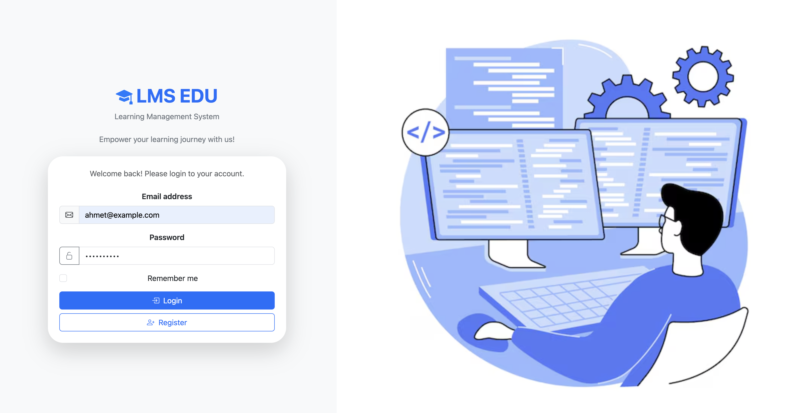
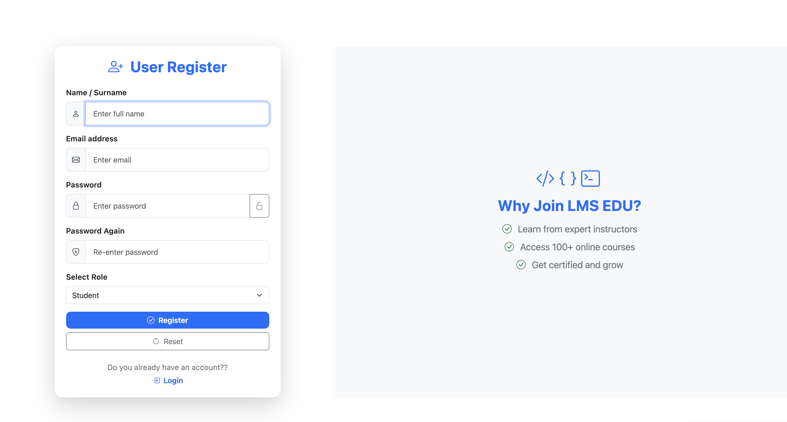
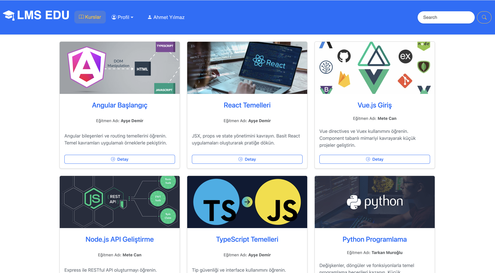
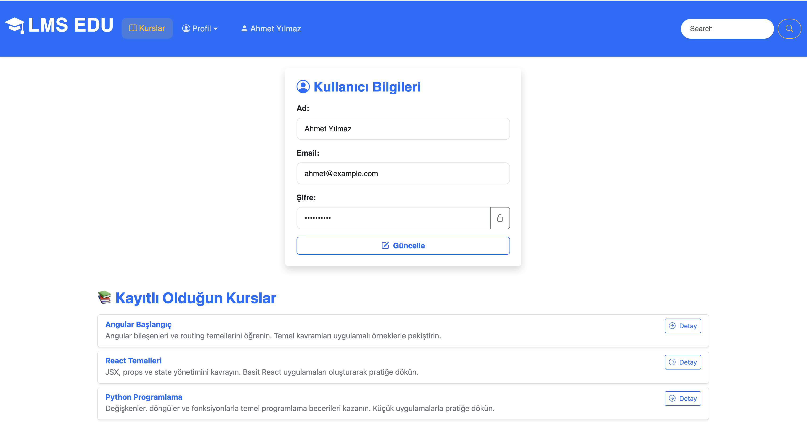
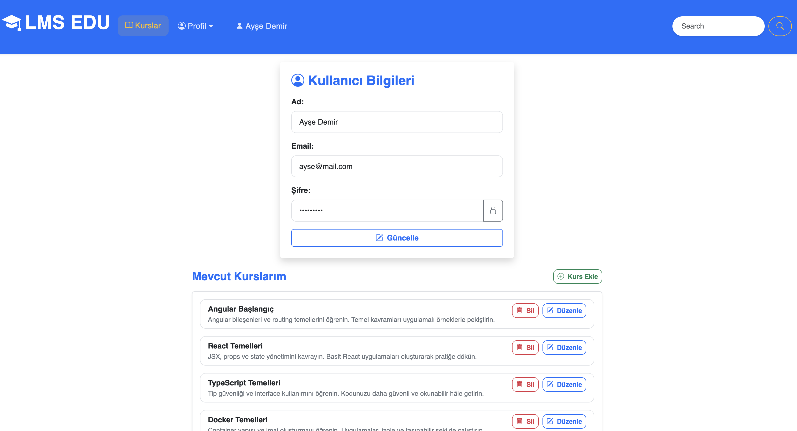
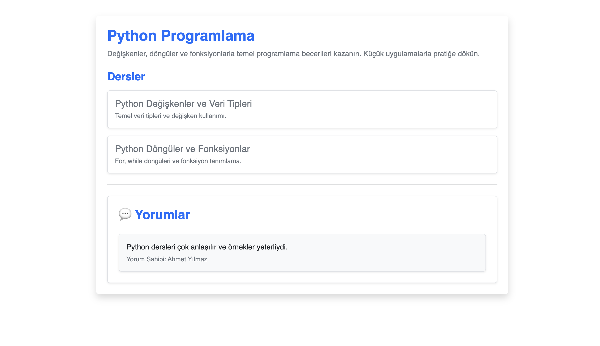
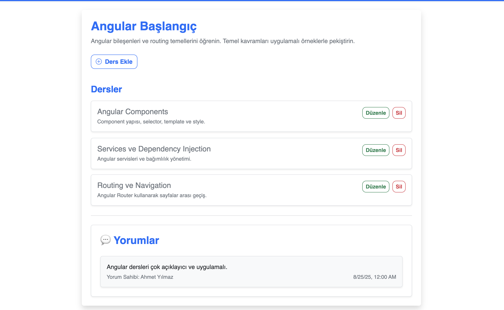

# 🎓 Angular Learning Management System

Bu proje, **Angular** kullanılarak geliştirilmiş bir **öğrenim yönetim sistemi (LMS) uygulamasıdır**.  
Kullanıcılar, derslere kayıt olabilir, içerikleri görüntüleyebilir ve derslere yorum yapabilirler.  

---

## 🎯 Proje Amacı

* API veya dummy veriler üzerinden dersleri listelemek  
* Her ders için **başlık**, **açıklama**, **eğitmen bilgisi** ve **kategori** göstermek  
* Seçilen dersin detay sayfasında:
  * **Ders açıklaması**, **içerikler** ve **yorumlar** bölümü  
* Angular ile **HTTP istekleri**, **routing**, **component yapısı** ve **rol bazlı erişim** uygulamak

---
## 🔧 Kullanılan Teknolojiler

* Angular 19.2.15,
* TypeScript
* HTML & CSS
* Bootstrap / Bootstrap Icons
* Backend: json-server
* HttpClient, Angular Routing, Forms Validation, Route Guards

---

## 🧭 Uygulama Özellikleri


### 🔹Kullanıcı Yönetimi

  * Kayıt ol ve giriş yap ekranları

  * LocalStorage ile token benzeri auth state tutulur

  * Rol bilgisi (student / instructor) giriş sırasında alınır

### 🔹 Role-Based Access Control (RBAC)

  * Student: Kurs görüntüleme, kursa kayıt, yorum yapma

  * Instructor: Kurs ve ders ekleme, düzenleme, silme

  * Route Guard ile yetkisiz erişim engellenir

### 🔹 Kurs ve Ders Yönetimi

  * Tüm kullanıcılar kursları görüntüleyebilir

  * Dersler kurs detay sayfasında listelenir

  * Eğitmen kurs ve ders ekleyebilir, düzenleyebilir, silebilir

### 🔹 Kursa Katılım (Enrollment)

  * Öğrenciler kursa kayıt olabilir

  * Kayıtlı kurslar profil sayfasında görüntülenir

### 🔹 Yorum Sistemi

  * Kurs detay sayfasında yorum ekleme ve görüntüleme

### 🔹 UI / UX

  * Angular Material veya Bootstrap kullanılmıştır

  * Responsive ve modern tasarım
---

---

## 👥 Örnek Kullanıcı Hesapları

 | Rol        | Email                                         | Password |
| ---------- | --------------------------------------------- | -------- |
| Student    | [ahmet@example.com](mailto:ahmet@example.com) | 1234!Ahmet    |
| Instructor | [ayse@mail.com](mailto:ayse@mail.com)  |1234!Ayşe    |

---

## 📸 Ekran Görüntüleri


### 🖼️ Giriş Ekranı
  
  ---

### 🖼️ Kayıt Ekranı
  
---

### 🖼️ Anasayfa/Kurs Listesi

---

### 🖼️ Öğrenci Paneli

---

### 🖼️ Eğitmen Paneli

---

### 🖼️ Kurs Detay


---

### 🖼️ Yorumlar
  

  
---

## 🚀 Kurulum ve Çalıştırma

Projeyi yerel ortamında çalıştırmak için aşağıdaki adımları izle:


```bash
# 1. Projeyi klonla
git clone https://github.com/muminemuroglu/learning-management-system-angular.git

# 2. Proje klasörüne gir
cd learning-management-system-angular

# 3. Bağımlılıkları yükle
npm install

# 4. Uygulamayı çalıştır
ng serve

# 5.Backend(JSON SERVER)
json-server --watch db.json --port 3001

# 6.Frontend
npm install
ng serve --port 4403


➡️ Tarayıcıdan http://localhost:4403 adresine giderek projeyi görüntüleyebilirsin.

```
---

## 📁 Proje Dosya Yapısı

lms
│
├─ src/app/
│   ├─ components/
│   ├─ models/
│   ├─ pages/
│   ├─ services/
│   ├─ utils/
│   ├─ guards/
│   └─ auth-guard.ts - role-guard.ts - notauth-guard.ts
│
├─ db.json
├─ package.json
└─ README.md

---

## 📝 Lisans / License

Bu proje MIT License ile lisanslanmıştır / This project is licensed under the MIT License.